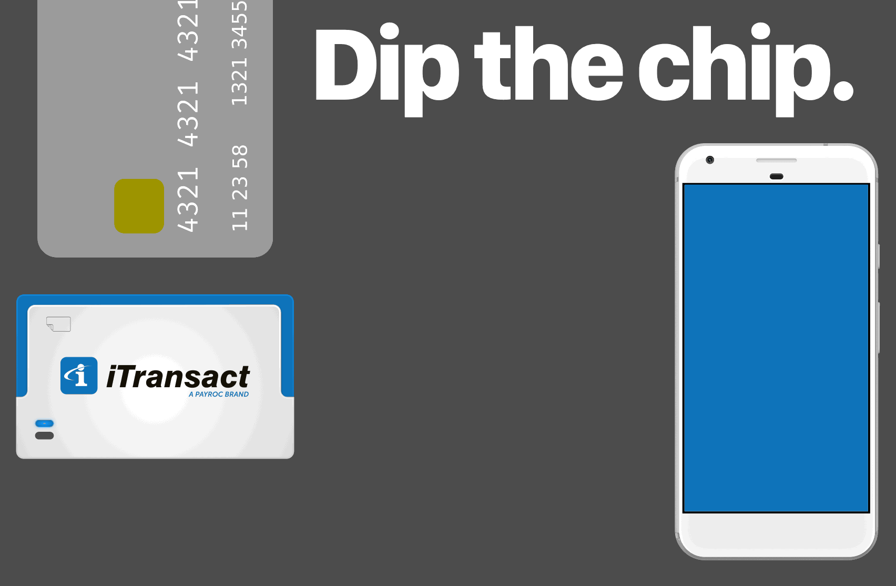

# iTransact SDK for NodeJS

As a quick helper for our NodeJS community to get up and running even faster in your favorite dependency manager, we have created this API / SDK wrapper specifically tailored for NodeJS and Express. 

More details at [iTransact Developer API](http://developers.itransact.com/api-reference/#operation/postTransactions)

[]

## Features
- [NodeJS](https://nodejs.org/en/)

## Usage 
If there is a platform you would like to see in addition to `npm` for dependency management, let us know.

### NPM Install
Run the following command at the root fo your project

```bash
npm install itransact-node
```

[iTransact SDK on NPM](https://www.npmjs.com/package/itransact-node)


### Manual Install

Download the zip, or use git submodules to pull the SDK into your project.

### Import Example

Here is an example implementation:

(see `/examples` for more)
#### Simple post transaction
```javascript
"use strict";
const itransact = require('itransact-core');

// Store these somewhere safe.
const api_username = 'test_user';
const api_key = 'test_key';

// You can use your own JSON Model, or use the included models.
const cardData = new itransact.cardDataModel();
cardData.name = 'Greg';
cardData.number = '4111111111111111';
cardData.cvv = '123';
cardData.exp_month = '11';
cardData.exp_year = '2020';

// Address is optional, unless using loopback /sandbox / demo account.
const addressData = new itransact.addressDataModel();
addressData.postal_code = '84025';

const payload = new itransact.transactionPostPayloadModel();
payload.amount = '1000';
payload.card = cardData;

let fooCallback = function (response) {
    // Do something with response here
};

itransact.postCardTransaction(payload, api_username, api_key, fooCallback);
```

#### Simple sign payload
```javascript
"use strict";
const itransact = require('itransact-core');

// Store this somewhere safe.
const api_key = 'test_key';

// You can use your own JSON Model, or use the included models.
const payload = {
    amount: '1000',
    card:{
        name: 'Greg',
        number: '4111111111111111',
        cvv: '123',
        exp_month: '11',
        exp_year: '2020'
    },
    'address': { // Address is optional, unless using loopback /sandbox / demo account.
        'postal_code': '84025'
    }
};

// IF you want to just sign the payload
let payloadSignature = itransact.signPayload(api_key, payload);
```

*Note - expected signature changes every time the api_username, api_key, and payload changes in any way. It is only included here for testing.*

*Demo Account Note - Loopback, Sandbox, and Demo accounts require postal_code, otherwise you will see an error similar to - "ZIP REQUIRED FOR KEYED TRANSACTION"*


#### Example Response
Example successful `postResult` using the example above will return a 201 with the following fields / value types:
```json
{
  "id": "string",
  "amount": 0,
  "status": "string",
  "settled": "string",
  "instrument": "string",
  "metadata": [
    {
      "key": "string",
      "value": "string"
    }
  ],
  "payment_source": {
    "name": "string",
    "default": "string",
    "type": "string",
    "expired": "string",
    "month": "string",
    "year": "string",
    "brand": "string",
    "last_four_digits": "string",
    "sec_code": "string"
  },
  "credits": {
    "amount": 0,
    "state": "string"
  },
  "credited_amount": "string"
}
```

Check out the files in `/examples` for other ideas for implementation.

## Testing

Unit tests on this project are run using Mocha. You can find each test in the `/test` folder.

After doing an npm install mocha, and chai will be available to run using the following command. 


```bash
npm test
```

Alternative Methods:

```bash
npm test-report
```

```bash
npm test-check-coverage
```

```bash
./node_modules/.bin/mocha --reporter spec
```  